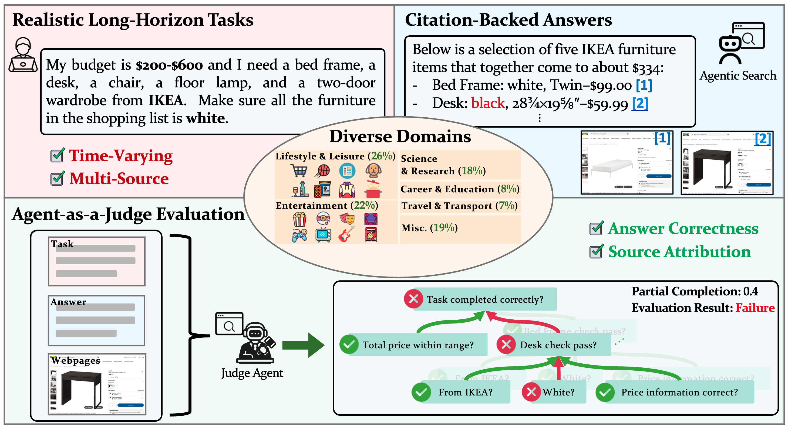

# Mind2Web 2

Mind2Web 2 is a benchmark for agentic search systems, featuring Agent-as-a-Judge methodology for comprehensive, rigorous, and reliable assessment.

<div align="center">
  
  <p><em>Mind2Web 2 features realistic and diverse long-horizon web search tasks and a novel Agent-as-a-Judge framework to evaluate complex, time-varying, and citation-backed answers.</em></p>
</div>

## Comparison to Existing Benchmarks
| Name | Horizon | # of Tasks | Time-Varying | Complex Synthesis | Attribution Verification | Evaluation |
|------|---------|------------|--------------|-------------------|-------------------------|------------|
| **Mind2Web 2** | **Long** | 130 | ✅ | ✅ | ✅ | **Agent-as-a-Judge** |
| [Online-Mind2Web](https://huggingface.co/spaces/osunlp/Online_Mind2Web_Leaderboard/) | Short | 300 | ✅ | ❌ | ❌ | LLM-as-a-Judge |
| [WebVoyager](https://github.com/MinorJerry/WebVoyager?tab=readme-ov-file) | Short | 643 | ✅ | ❌ | ❌ | LLM-as-a-Judge |
| [Mind2Web-Live](https://github.com/iMeanAI/WebCanvas?tab=readme-ov-file) | Short | 542 | ✅ | ❌ | ❌ | Rule |
| [BEARCUBS](https://bear-cubs.github.io) | Short | 111 | ❌ | ❌ | ❌ | Answer Match |
| [WebWalkerQA](https://github.com/Alibaba-NLP/WebAgent/tree/main/WebWalker) | Short | 680 | ❌ | ❌ | ❌ | Answer Match |
| [GAIA](https://huggingface.co/spaces/gaia-benchmark/leaderboard) | Medium | 466 | ❌ | ❌ | ❌ | Answer Match |
| [AssistantBench](https://assistantbench.github.io) | Medium | 214 | ❌ | ❌ | ❌ | Answer Match |
| [BrowseComp](https://openai.com/index/browsecomp/) | Long | 1,266 | ❌ | ❌ | ❌ | Answer Match |

## 🔗 Links

- [🏠 Homepage](https://osu-nlp-group.github.io/Mind2Web-2)
- [🏆 Leaderboard](https://osu-nlp-group.github.io/Mind2Web-2/#leaderboard)
- [📖 Paper](https://arxiv.org/abs/2506.21506)
- [😊 Dataset (Tasks)](https://huggingface.co/datasets/osunlp/Mind2Web-2)

## 🆕 Updates
- **2025/07/17**: Check out our [submission guideline](#-submission-guideline). We welcome all submissions and look forward to your participation!
- **2025/07/14**: The scripts of the public development set are released. Give them a try!
- **2025/06/26**: The GitHub repo is live. The manuscript is now on arXiv.

## 📥 Submission Guideline

Submitting to our benchmark couldn't be easier! 

Just collect your agent’s answers and send them to us. We’ll take care of all the evaluation steps for you, including the cost of running our Agent-as-a-Judge evaluation.

1. **Collect answers from your agent:** Provide your agent with the task descriptions of our [private test set](https://huggingface.co/datasets/osunlp/Mind2Web-2/viewer/default/private_test_set) and collect its responses.

2. **Organize your submission:** Arrange your agent's responses in the following directory structure (see [answers/examples](https://github.com/OSU-NLP-Group/Mind2Web-2/tree/main/answers/example) for reference):

   ```
   <agent_name>
   ├── <task_id>
   │   ├── answer_1.md
   │   ├── answer_2.md
   │   └── ...
   └── ...
   ```

3. **Submit your answers:** Compress the directory and send it to us via email: m2w2-leaderboard@googlegroups.com.

We welcome all submissions and look forward to your participation! 🚀

> **Note:**
>
> The guidelines above describe how to submit your agent's answers on our **private test set** for official evaluation (**we will handle all evaluation steps for you**!).
>
> If you would like to **explore our public dev set and run the evaluation locally**, please refer to the sections below for environment setup and evaluation instructions.


## 🚀 Run Evaluation Locally Yourself

### 0. Environment Setup

#### Option 1: Using uv (Recommended)

If you have [uv](https://docs.astral.sh/uv/) installed, it provides faster dependency resolution and installation:

```bash
# Automatically create virtual environment and install all dependencies
uv sync

# Activate the virtual environment
source .venv/bin/activate  # On Windows: .venv\Scripts\activate

# Install browsers for Playwright
playwright install
```

#### Option 2: Using conda + pip

```bash
# Create and activate conda environment
conda create -n mind2web2 python=3.11
conda activate mind2web2

# Install the package in development mode
pip install -e .

# Install browsers for Playwright
playwright install
```

### 1. Prepare Your Data

Organize your agent's responses in the following directory structure:

```
answers/
└── <your_agent_name>/
    └── <task_id>/
        ├── answer_1.md
        ├── answer_2.md
        └── ...
```

Each answer file should contain your agent's response in markdown format.

### 2. Set up API Keys

Configure the necessary API keys for evaluation:

```bash
# Set up environment variables for OpenAI API
export OPENAI_API_KEY="YOUR_OPENAI_API_KEY"

# (Optional) Environment variables for Azure OpenAI
export AZURE_OPENAI_API_KEY="YOUR_AZURE_OPENAI_API_KEY"
export AZURE_OPENAI_ENDPOINT_URL="YOUR_AZURE_OPENAI_ENDPOINT_URL"
export AZURE_OPENAI_API_VERSION="2025-03-01-preview"

# (Optional) Tool APIs for tasks that require google map APIs
export GOOGLE_MAPS_API_KEY="YOUR_GOOGLE_MAPS_API_KEY"
```

### 3. Precache Webpages (Optional but Recommended)

*Note: This step is not required but highly recommended for reducing evaluation latency, as fetching webpages on-the-fly during evaluation can be very slow.*

Before running evaluation, you may want to precache the webpages to improve performance:

```bash
# Coming Soon!
```

We also provide a lightweight script to fix errors in precached webpages (e.g., pages blocked by human verification):

```bash
# Coming Soon!
```

### 4. Run Evaluation

Execute the evaluation using the `run_eval.py` script:

#### Basic Usage

```bash
# Evaluate all tasks for a specific agent
python run_eval.py --agent_name <your_agent_name>

# Evaluate a specific task
python run_eval.py --agent_name <your_agent_name> --task_id <task_id>
```

for example:

```bash
python run_eval.py --agent_name example

python run_eval.py --agent_name example --task_id yu_lineage
```

#### Advanced Configuration

- `--agent_name`: Name of your agent (required)
- `--answer_folder`: Path to directory containing answer files (default: `answers/`)
- `--eval_scripts_root`: Root directory for evaluation scripts (default: `eval_scripts/`)
- `--eval_results_root`: Root directory to save evaluation results (default: `eval_results/`)
- `--cache_root`: Root directory for caching webpages (default: `cache/`)
- `--eval_version`: Version of evaluation scripts to use (default: `2025_07_14`)
- `--task_id`: Specific task to evaluate (optional, evaluates all tasks if not provided)
- `--llm_provider`: LLM provider (`openai` or `azure_openai`, default: `openai`)
- `--max_concurrent_tasks`: Maximum concurrent task evaluations (default: 2)
- `--max_concurrent_answers`: Maximum concurrent answer evaluations per task (default: 3)
- `--max_webpage_retrieval`: Maximum concurrent webpage retrievals (default: 5)
- `--max_llm_requests`: Maximum concurrent LLM API requests (default: 30)
- `--dump_cache`: Persist cache to disk (default: True)
- `--overwrite`: Overwrite existing results

## 📝 Citation

If you find this work useful, please consider starring our repo and citing our papers:

```bibtex
@misc{gou2025mind2web2,
    title = {Mind2Web 2: Evaluating Agentic Search with Agent-as-a-Judge}, 
    author = {Boyu Gou and Zanming Huang and Yuting Ning and Yu Gu and Michael Lin and Weijian Qi and Andrei Kopanev and Botao Yu and Bernal Jiménez Gutiérrez and Yiheng Shu and Chan Hee Song and Jiaman Wu and Shijie Chen and Hanane Nour Moussa and Tianshu Zhang and Jian Xie and Yifei Li and Tianci Xue and Zeyi Liao and Kai Zhang and Boyuan Zheng and Zhaowei Cai and Viktor Rozgic and Morteza Ziyadi and Huan Sun and Yu Su},
    year = {2025},
    eprint = {2506.21506},
    archivePrefix = {arXiv},
    primaryClass = {cs.AI}
}
```
