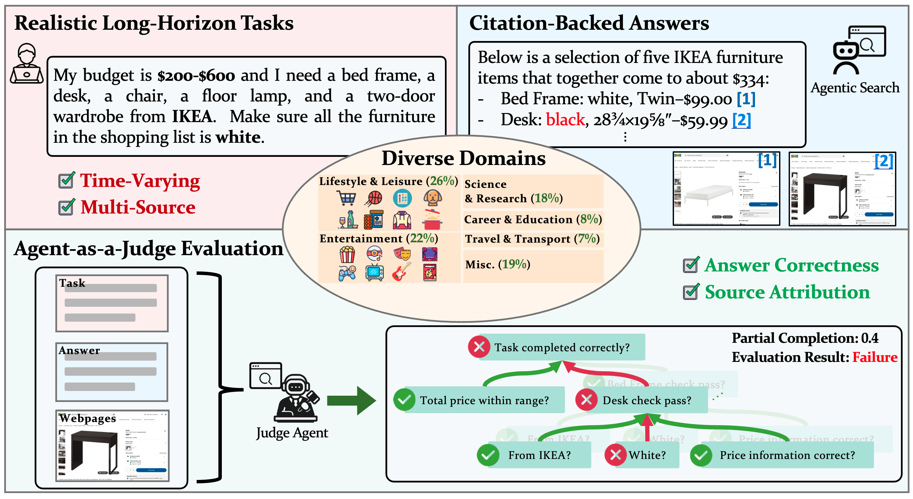
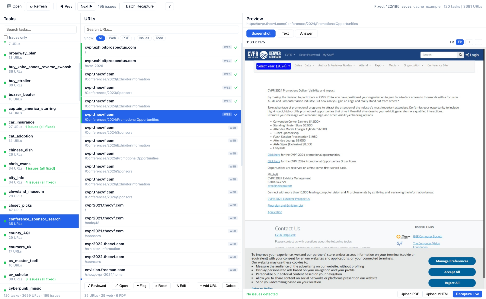

# Mind2Web 2 [NeurIPS'25 D&B]

Mind2Web 2 is a benchmark for agentic search systems, featuring Agent-as-a-Judge methodology for comprehensive, rigorous, and reliable assessment on **long-horizon** and complex tasks that involve **complex and real-time information synthesis**.

<div align="center">
  
  <p><em>Mind2Web 2 features realistic and diverse long-horizon web search tasks and a novel Agent-as-a-Judge framework to evaluate complex, time-varying, and citation-backed answers.</em></p>
</div>

## 🔗 Links

- [🏠 Homepage](https://osu-nlp-group.github.io/Mind2Web-2)
- [🏆 Leaderboard](https://osu-nlp-group.github.io/Mind2Web-2/#leaderboard)
- [📖 Paper](https://arxiv.org/abs/2506.21506)
- [😊 Dataset (Tasks) and Evaluation Scripts (Judge Agents)](https://huggingface.co/datasets/osunlp/Mind2Web-2)

## 🆕 Updates
- **2025/10/23**: To improve accessibility and adoption of Mind2Web 2, all evaluation scripts are released for both public dev set and test set. Check out the [Run Evaluation Locally Yourself](#-run-evaluation-locally-yourself) section for instructions.
- **2025/07/17**: Check out our [submission guideline](#-submission-guideline). We welcome all submissions and look forward to your participation!
- **2025/07/14**: The scripts of the public development set are released. Give them a try!
- **2025/06/26**: The GitHub repo is live. The manuscript is now on arXiv.


## 📥 Submission Guideline

To get answers for tasks of Mind2Web 2:
- If you are developing and testing a base model and have no agent framework at hand, you may start from go-to frameworks such as [Hugging Face's Open Deep Research](https://huggingface.co/blog/open-deep-research). You may want to do some zero-shot or few-shot prompting to let the agent better understand how to provide citations, to pass our attribution verifications in the task evaluations.
- If you have your own agent, still notice that we expect the agent to also provide **URL sources** to the critical facts included in the answers. You may also refer to the evaluation script to understand how the evaluation is conducted.

To evaluate answers from an agent system, there are mainly four steps involved:
1. Collecting answers from your agent on our [test set](https://huggingface.co/datasets/osunlp/Mind2Web-2/viewer/default/private_test_set)
2. Cache the webpages mentioned in the answers (to ensure consistency and reproducibility), where we provide the script in [Precache Webpage](#3-precache-webpages-optional-but-recommended)
3. Run the evaluation.
4. (Optional) Record how long each run took in `answer_<k>.meta.json` (see below), so that the leaderboard can report the agent's time.

For the submission, you can either:
- **(Recommended)** Submit your agent's answers along with the webpage cache to us. This ensures the best consistency between inference and evaluation. We will handle the evaluation cost for you.
- **(Also Recommended)** Run the whole evaluation yourself by following the instructions in the [next section](#-run-evaluation-locally-yourself) and submit the evaluation results to us.
- Only provide your agent's answers and let us handle the webpage caching and evaluation for you.

If you choose to submit your agent's answer, please arrange your agent's responses in the following directory structure (see [answers/example](https://github.com/OSU-NLP-Group/Mind2Web-2/tree/main/answers/example) for reference):

   ```
   <agent_name>
   ├── <task_id>
   │   ├── answer_1.md
   │   ├── answer_1.meta.json   # optional: {"time_seconds": 512.3}
   │   ├── answer_2.md
   │   └── ...
   └── ...
   ```

Each `answer_<k>.md` is one independent run of your agent on the task; the leaderboard uses three runs, `answer_1.md` to `answer_3.md`. The optional `answer_<k>.meta.json` records the wall-clock time the run took, in seconds. Check the layout before submitting (the task lists `dev_set.csv` and `test_set.csv` come with the [dataset](https://huggingface.co/datasets/osunlp/Mind2Web-2); the commands in this README expect it in `osunlp/Mind2Web-2/`, where the download command in [Run Evaluation](#4-run-evaluation) puts it):

   ```bash
   uv run mind2web2 validate <agent_name> --task-list osunlp/Mind2Web-2/test_set.csv --num-runs 3
   ```

It reports tasks or runs without an answer, empty answers, answers that cite no URL, files that evaluation would ignore, and invalid metadata. It looks for `<agent_name>` under `answers/`; pass `--answers-dir <dir>` if the directory is elsewhere.

Similarly, the corresponding cache structure should be `cache/<agent_name>/` (generated by `mind2web2 cache`).

Compress the directories and send them to us via email: m2w2-leaderboard@googlegroups.com.

> **Note:**

> If you would like to **explore our tasks and run the evaluation locally**, please refer to the sections below for environment setup and evaluation instructions.


## 🚀 Run Evaluation Locally Yourself

### 0. Environment Setup

#### Option 1: Using uv (Recommended)

If you have [uv](https://docs.astral.sh/uv/) installed, it provides faster dependency resolution and installation:

```bash
# Automatically create virtual environment and install all dependencies
uv sync

# Activate the virtual environment
source .venv/bin/activate  # On Windows: .venv\Scripts\activate

# Install browsers for Playwright (we use patchright for better stealth browsing)
patchright install
```

#### Option 2: Using conda + pip

```bash
# Create and activate conda environment
conda create -n mind2web2 python=3.11
conda activate mind2web2

# Install the package in development mode
pip install -e .

# Install browsers for Playwright
patchright install
```

### 1. Prepare Your Data

Organize your agent's responses in the following directory structure:

```
answers/
└── <your_agent_name>/
    └── <task_id>/
        ├── answer_1.md
        ├── answer_1.meta.json   # optional: {"time_seconds": 512.3}
        ├── answer_2.md
        └── ...
```

Each `answer_<k>.md` file contains your agent's response for run `k` (1, 2, 3, ..., without leading zeros) in markdown format; evaluation ignores files with other names. To check the layout, run `uv run mind2web2 validate <your_agent_name>`.

### 2. Set up API Keys

The judge is an OpenAI model, `gpt-6-luna` by default (see `--judge-model` below). Configure the necessary API keys for evaluation:

```bash
# Set up environment variables for OpenAI API
export OPENAI_API_KEY="YOUR_OPENAI_KEY"

# (Optional) Send judge requests to an OpenAI-compatible server instead, e.g. a LiteLLM proxy
export OPENAI_BASE_URL="http://localhost:4000"

# (Optional) Environment variables for Azure OpenAI
export AZURE_OPENAI_API_KEY="YOUR_AZURE_OPENAI_API_KEY"
export AZURE_OPENAI_ENDPOINT_URL="YOUR_AZURE_OPENAI_ENDPOINT_URL"
export AZURE_OPENAI_API_VERSION="2025-03-01-preview"

# (Optional, but necessary for several tasks) Tool APIs for tasks that require google map APIs
export GOOGLE_MAPS_API_KEY="YOUR_GOOGLE_MAPS_API_KEY"
```

### 3. Precache Webpages (Optional but Recommended)

*Note: This step is not required but highly recommended for reducing evaluation latency, as fetching webpages on-the-fly during evaluation can be very slow.*

The commands below run as `uv run mind2web2 <command>`; in an activated environment, `mind2web2 <command>` works as well. Before running evaluation, store the webpages that the answers cite:

```bash
uv run mind2web2 cache <your_agent_name>
```

The command extracts the URLs of every answer with a regular expression and two LLMs (`gpt-6-luna` and `gpt-4.1`, which recover URLs written without a scheme or split across lines; `--no-llm` uses the regular expression alone and needs no API key; `--llm-base-url` sends their requests to an OpenAI-compatible endpoint, as `--judge-base-url` does for the judge). It stores each page in `cache/<your_agent_name>/<task_id>/`, as text and a screenshot, or as the PDF. Spellings of a URL that differ only in scheme, `www.`, a trailing slash, the fragment, UTM parameters, or percent-encoding are merged across a task's answers, so a page that several answers cite is captured once, and if its capture fails, its other spellings are tried; spellings that differ in letter case are captured separately, and so is a spelling that encodes a `#` or `%` (`?q=C%23`) from the one it decodes to (`?q=C`), since they can be different pages. Each task's URL list is saved in `cache/<your_agent_name>/<task_id>.json` and reused while the task's answers and the URL-extraction models are unchanged; a list made while an LLM request failed is extracted again on the next run, and `--refresh-urls` forces a new extraction. Task directories without `answer_<k>.md` files are skipped. All tasks share one browser with at most five pages open (`--max-pages`). At the end it prints, for each task, how many URLs were already cached, newly stored, or could not be captured, and it marks tasks whose URL extraction was incomplete. The command can be run again at any time, for example after adding answers: cached URLs are skipped, and a URL whose capture failed is recorded and tried again only with `--retry-failed`. Run `uv run mind2web2 cache --help` for all options.

Some pages may fail to cache automatically due to CAPTCHAs, anti-bot protection, or login walls. We provide a **[Cache Manager](cache_manager_web/)** web tool to review and **batch-fix** these issues — it auto-detects problematic pages and lets you recapture all flagged URLs in one click using a Chrome Extension.

```bash
# Start the Cache Manager web UI (auto-opens in browser)
uv run python3 cache_manager_web/run.py <your_agent_name>
```

<div align="center">
  
</div>

See the [Cache Manager README](cache_manager_web/README.md) for full documentation and Chrome Extension setup.

### 4. Run Evaluation

The eval scripts of the public dev set are in `eval_scripts/dev_set/`. The scripts of all tasks, dev and test, are in the gated [Hugging Face dataset](https://huggingface.co/datasets/osunlp/Mind2Web-2): accept its terms on the dataset page, then download it. The `osunlp/` directory is git-ignored, so the scripts stay out of your commits.

```bash
uvx --from huggingface_hub hf auth login
uvx --from huggingface_hub hf download osunlp/Mind2Web-2 --repo-type dataset --local-dir osunlp/Mind2Web-2
```

Then evaluate:

```bash
# Dev-set tasks, with the scripts in eval_scripts/dev_set/
uv run mind2web2 evaluate <your_agent_name>

# Test-set tasks, with the downloaded scripts; the metrics cover the whole split
uv run mind2web2 evaluate <your_agent_name> \
    --eval-scripts-dir osunlp/Mind2Web-2/evaluation_scripts \
    --task-list osunlp/Mind2Web-2/test_set.csv --num-runs 3

# A single task
uv run mind2web2 evaluate example --task yu_lineage
```

Each task's eval script scores every `answer_<k>.md` of the task, and each result is saved under `eval_results/<your_agent_name>/<task_id>/`. Eval scripts are released in version directories named by date, such as `evaluation_scripts/2025_10_23/`; the newest version is used unless `--eval-version` names another. Without `--task-list` or `--task`, the command evaluates the tasks that have both answers and an eval script, and says how many answered tasks it skipped for lack of a script; with either option, a selected task without an eval script leaves its answers unscored. Pages come from the cache, and a page missing from it is captured live and added to it. The judge gets each page's text, cut off after 100,000 tokens, and its screenshot, scaled down to at most 1100 pixels wide and split into parts of at most 2000 pixels tall (overlapping by 100 pixels), so that the judge model does not scale it down further; at most 5 parts are sent, which cover the top 9,600 pixels of a long page. An answer whose latest result scored the same answer file with the same judge configuration, eval script, evaluator settings, and scoring version is not evaluated again unless `--overwrite`, so after an interruption or a failure, running the command again evaluates only the answers without such a result. The command ends with one line per task (answers scored, mean score) and the metrics of the next section, and it exits with status 1 if some answer has no result.

The main options; run `uv run mind2web2 evaluate --help` for all options and their defaults:

- `--judge-model`: Judge model; every judge request uses it, whatever model an eval script names (default: `gpt-6-luna`). The paper's results were judged by `o4-mini`; scores from different judges are not directly comparable.
- `--judge-reasoning-effort`: `reasoning_effort` for reasoning-model judges (default: `max` for `gpt-6-luna`, the model's own default for any other model)
- `--judge-temperature`: `temperature` for non-reasoning judges such as `gpt-4.1` (default: not sent)
- `--llm-provider`: `openai` or `azure_openai`; `--judge-base-url` sends the `openai` provider's requests to an OpenAI-compatible endpoint (default: `$OPENAI_BASE_URL`, else the OpenAI API)
- `--num-runs`: runs per task in the metrics printed at the end (default: the highest run index found; the leaderboard uses 3). Every answer is evaluated regardless.
- `--max-tasks`, `--max-answers`, `--max-pages`, `--max-llm-requests`: tasks, answers per task, live page captures, and judge requests processed at once
- `--headless`: capture live pages in a browser without a window
- `--answers-dir`, `--cache-dir`, `--results-dir`, `--eval-scripts-dir`: where answers, the cache, results, and eval-script versions are (default: `answers/`, `cache/`, `eval_results/`, `eval_scripts/`)
- `--overwrite`: evaluate answers again even if they have a result. Without it, an answer's latest result is reused when it scored the same answer file with the same judge configuration, the same eval script, the same evaluator settings (such as the size limits of the screenshots sent to the judge), the same scoring version (a number the framework raises when a change to its prompts, page handling, or score aggregation can change scores), and the same `MIND2WEB2_EVAL_DATE` (the date, as `YYYY-MM-DD`, that eval scripts whose rubric depends on today's date take as today; unset, they use the current date, and a result made without it on an earlier day is reused, so set it when one run's answers are evaluated over several days); otherwise the answer is evaluated again. Changes to the cached pages are not detected, so pass `--overwrite` after recapturing or editing pages in the Cache Manager. Neither is the judge's provider or endpoint (`--llm-provider`, `--judge-base-url`), which only the model name identifies, so pass `--overwrite` when a new endpoint serves another model under the same name. Before an answer is evaluated, its earlier results move to `results/superseded/`.

**Logs.** While the command runs, the console shows one progress bar over all answers and one line per answer with its score, or with the reason it has no result. Each evaluation of an answer writes a log next to its result, in `eval_results/<agent>/<task_id>/answer_<k>/logs/`, with one line per extraction and per check: the check's node id, the source page, whether it passed and by how many of the judge's votes, and the claim and the judge's reasoning indented below. An answer that has no result ends its log with the error's traceback. The run's own log, in `eval_results/<agent>/logs/`, holds the lines the console showed and the records that go only to the log. Each log is a readable `.log` file and a `.jsonl` file with one JSON object per event and every field, for filtering with tools such as `jq`; for example, `jq -r 'select(.status == "failed") | [.node_id, .url // "-"] | @tsv' <answer log>.jsonl` lists the checks that failed, with the page each was checked against (for a claim with several sources, a failed source does not fail its node when another source supports the claim). `mind2web2 cache` writes its log to `cache/logs/`.

### 5. Compute Metrics

`mind2web2 evaluate` ends by printing and saving the metrics over the tasks it was run on, unless `--task` limits it to single tasks. To compute the metrics from saved results at any time, run:

```bash
# Over the tasks your agent has answers for
uv run mind2web2 metrics <your_agent_name>

# Over a full split with the leaderboard's three runs: missing answers and results count as 0
uv run mind2web2 metrics <your_agent_name> --task-list osunlp/Mind2Web-2/test_set.csv --num-runs 3
```

The command reports the metrics of the paper and the leaderboard. Run `k` consists of the `answer_<k>.md` files, and a task's score is the root score of its rubric tree, between 0 and 1. Scores are comparable only when one judge model produced them all; every result records its judge, and the report warns when the results mix judges.

| Metric | Definition |
| --- | --- |
| Partial Completion | Mean task score over the tasks of a run |
| Success Rate | Fraction of the tasks of a run with score 1 |
| Pass@k | Fraction of tasks for which at least one of the k runs has score 1 (Pass@3 on the leaderboard) |
| Time (min) | Mean inference time in minutes, from `time_seconds` in `answer_<k>.meta.json`, over the answers of a run that report it |
| Answer Length | Mean number of words (whitespace-separated tokens) in the answers of a run |

Every metric except Pass@k is computed per run and reported as the mean ± population standard deviation over runs. The number of runs k is the highest run index among the answers unless `--num-runs` is given. An answer that is missing, or that has no evaluation result, counts as a score of 0 in Partial Completion, Success Rate, and Pass@k, and the report lists each one so that it can be fixed and re-evaluated; Time and Answer Length are averaged over the answers that exist. An answer has no result when its evaluation failed, including when a judge request still failed after retries: such an answer is left unscored rather than marked wrong, and running `mind2web2 evaluate` again evaluates it. A request that the judge rejects because of its content (a refusal, a content filter, an output cut off at the token limit, or a request too long even with the page text shortened) would fail again whenever it is sent, so it counts as a failed vote of its check instead (the check fails unless majority voting has other votes; a rejected extraction gives empty values), and the answer is scored; the report lists the answers with such requests. A result that scored a different version of the answer file (the answer was replaced after its evaluation) is not used either: the answer counts as 0 and is listed until it is evaluated again. The metrics are also saved to `eval_results/<agent_name>/metrics.json`, together with the tasks they cover, per-run, per-task, and per-domain breakdowns (domains come from the CSV task list), and a `leaderboard_entry` block in the leaderboard's format. The leaderboard entry is written only for metrics over a task list with 3 runs whose results all come from one judge model that they record; without `--task-list` the metrics cover the tasks the agent has answers for, and the entry is `null`. Whether the task list is a whole split is not checked, so pass the split's own list.

### 6. Browse the Results

`mind2web2 evaluate` also writes `eval_results/<your_agent_name>/report.html`, a single HTML file to open in a browser; `uv run mind2web2 report <your_agent_name>` writes it again from the saved results (`--task` limits it to given tasks, `--output` names another file, `--cache-dir` names the page cache). It shows the saved metrics with a bar per run, charts of how the answers' scores are distributed and how many checks passed, failed, or were skipped, and a table of every task's score in every run, which can be sorted by mean. Each task then names the check that failed most often among its scored runs and lists its answers. A collapsed answer shows its score, a square per check marked by its status (filled, slashed, or hollow), and the checks that lost points; an open answer starts with those failed checks and their evidence (the claim, the page with a thumbnail of its cached screenshot, the judge's votes, and its reasoning), then shows the rubric tree next to the answer text, where every other verified check has its evidence one click away and a skipped check names the check it depended on or the step it came after (a check inside a step that a sequential node cut off after an earlier step fell below 1.0 counts as skipped, since it did not reach the score). A sidebar filters the tasks, shows only answers below 1.0, and hides skipped checks; `/` jumps to the filter and `j` / `k` to the next and previous answer. The thumbnails come from the page cache in `--cache-dir`, cover the top of each page, and stop after 8 MB per report, so a report of many tasks names where they stop. The evidence is part of each result file (`evidence` on the leaves of `verification_tree`), so results saved before it was recorded show the tree without it until they are evaluated again with `--overwrite` (the evidence is not part of what decides whether a result is reused). The page loads nothing from the network and runs only its own script, so it can be opened from disk and shared as a file.

## 🧪 Development

Dependencies are pinned in `uv.lock`, so `uv sync` installs the exact versions the harness was tested with. The test suite runs offline: it needs no API keys, network access, or browser.

```bash
uv sync           # also installs the dev dependency group (pytest, time-machine)
uv run pytest -q
```

`tests/test_eval_scripts_offline.py` runs every script in `eval_scripts/dev_set/` end to end with a deterministic fake judge, a synthetic webpage cache, and a fixed clock, under four input policies (see `tests/offline_eval.py`), and compares each resulting rubric tree with its golden file in `tests/golden/offline/`. A harness change that alters any rubric result therefore fails a test. After an intentional change, regenerate the golden files and review their diff:

```bash
uv run pytest tests/test_eval_scripts_offline.py --update-golden
```

The same test can check the full script release from Hugging Face without adding it to the repository. Record golden files outside the repository on the base commit, then compare after your change:

```bash
uv run pytest tests/test_eval_scripts_offline.py --eval-scripts-dir <hf_download>/evaluation_scripts/2025_10_23 \
    --golden-dir <private_dir> --update-golden   # on the base commit
uv run pytest tests/test_eval_scripts_offline.py --eval-scripts-dir <hf_download>/evaluation_scripts/2025_10_23 \
    --golden-dir <private_dir>                   # after the change
```

## 📝 Citation

If you find this work useful, please consider starring our repo and citing our papers:

```bibtex
@inproceedings{
    gou2025mind2web2,
    title={Mind2Web 2: Evaluating Agentic Search with Agent-as-a-Judge},
    author={Boyu Gou and Zanming Huang and Yuting Ning and Yu Gu and Michael Lin and Botao Yu and Andrei Kopanev and Weijian Qi and Yiheng Shu and Jiaman Wu and Chan Hee Song and Bernal Jimenez Gutierrez and Yifei Li and Zeyi Liao and Hanane Nour Moussa and TIANSHU ZHANG and Jian Xie and Tianci Xue and Shijie Chen and Boyuan Zheng and Kai Zhang and Zhaowei Cai and Viktor Rozgic and Morteza Ziyadi and Huan Sun and Yu Su},
    booktitle={The Thirty-ninth Annual Conference on Neural Information Processing Systems Datasets and Benchmarks Track},
    year={2025},
    url={https://openreview.net/forum?id=AUaW6DS9si}
}
```
