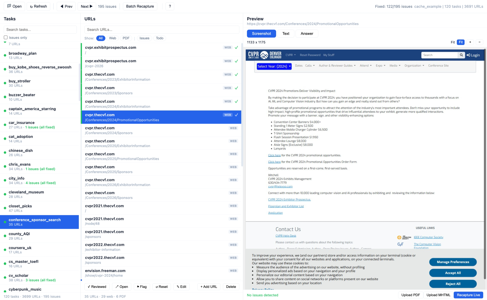

# Cache Manager Web

A browser-based tool for reviewing and batch-fixing cached webpages used in [Mind2Web 2](https://github.com/OSU-NLP-Group/Mind2Web-2) evaluation. Paired with a Chrome Extension, it can **automatically recapture hundreds of broken pages** (CAPTCHA walls, access denied, empty pages, etc.) with minimal manual effort.

<div align="center">
  
  <p><em>Three-panel layout: tasks (left), URLs (center), and content preview (right) with issue detection and batch recapture.</em></p>
</div>

## Getting Started

### 1. Start the Server

```bash
# By agent name (looks up cache/<agent_name>)
uv run python3 cache_manager_web/run.py <agent_name>

# By full path
uv run python3 cache_manager_web/run.py /path/to/cache/folder

# Options
uv run python3 cache_manager_web/run.py <agent_name> --port 8000 --no-browser
```

The web UI opens automatically in your browser.

### 2. Install the Chrome Extension

1. Open `chrome://extensions` and enable **Developer mode**
2. Click **Load unpacked** and select the `cache_manager_web/extension/` folder
3. Pin the extension icon for easy access

### 3. Review & Fix

1. **Browse tasks** — select a task from the left panel to see its URLs
2. **Check issues** — red = definite issue, yellow = possible issue, green = reviewed OK
3. **Navigate quickly** — use `j`/`k` to move between URLs, `n`/`N` to jump across issues in all tasks
4. **Preview** — toggle between screenshot (`1`), extracted text (`2`), and agent answer (`3`) views

## Batch Recapture (One-Click Fix)

The most powerful feature — fix all broken pages at once:

1. Click **Batch Recapture** in the toolbar (queues all flagged URLs)
2. Click the Chrome Extension icon → **Start Auto-Capture**
3. The extension automatically opens each URL, waits for it to load, captures the page, and advances to the next one
4. If a CAPTCHA is detected (Cloudflare, reCAPTCHA, hCaptcha, etc.), it pauses and waits for you to solve it, then continues
5. Pages with very short content are auto-retried (up to 2 times)
6. After batch completes, review the recaptured URLs (shown in blue) and press `r` to confirm each

## Single-Page Recapture

For pages that need manual intervention (login walls, complex anti-bot):

1. Select the URL and click **Recapture Live** (or press `u`)
2. The page opens in a new browser tab — solve any CAPTCHA or login
3. Click the extension icon → **Capture This Page**
4. The UI updates instantly via SSE

## URL Management

- **Flag** (`f`) — manually mark a URL as broken for batch recapture
- **Reset** (`x`) — clear cached content and auto-flag for re-download
- **Edit** (`e`) — change the URL link (content is preserved)
- **Add** (`a`) — add a new URL (auto-flagged; `.pdf` URLs detected automatically)
- **Delete** (`d`) — remove a URL and its cached files
- **Upload** — drag-and-drop `.pdf` or `.mhtml` files onto the preview panel

## Keyboard Shortcuts

| Key | Action |
|-----|--------|
| `j` / `↓` | Next URL |
| `k` / `↑` | Previous URL |
| `n` | Next issue (cross-task) |
| `N` | Previous issue (cross-task) |
| `r` | Mark as reviewed |
| `f` | Flag as issue |
| `d` | Delete URL |
| `x` | Reset URL cache |
| `e` | Edit URL |
| `a` | Add new URL |
| `o` | Open in browser |
| `u` | Recapture live |
| `1` / `2` / `3` | Screenshot / Text / Answer view |
| `Space` | Toggle Screenshot / Text |
| `?` | Full help & usage guide |

## Recommended Workflow

1. Run `./cache_all_answers.sh <agent>` to pre-cache all URLs
2. Start the Cache Manager and review the issue count per task
3. Use `n` to jump through flagged issues — quick-check screenshot vs text
4. Click **Batch Recapture** to auto-fix all red URLs at once
5. After batch, review blue URLs and press `r` to confirm each is fixed
6. For remaining stubborn pages, use **Recapture Live** one by one
7. For PDF pages misrecorded as web, use **Upload PDF** or drag-and-drop

## URL Color Legend

| Color | Meaning |
|-------|---------|
| Red | Definite issue — needs recapture |
| Yellow | Possible issue — check manually |
| Blue | Batch-recaptured — needs human review |
| Green | Reviewed OK / Fixed |
| Grey | No issues detected |
